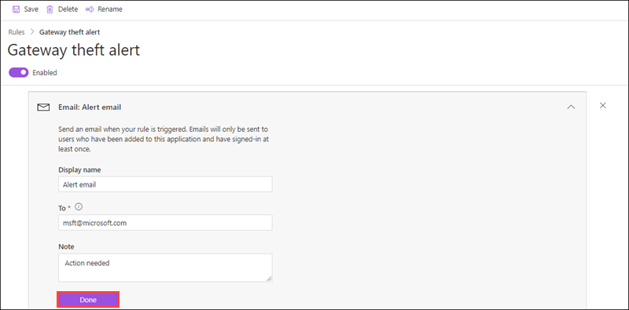
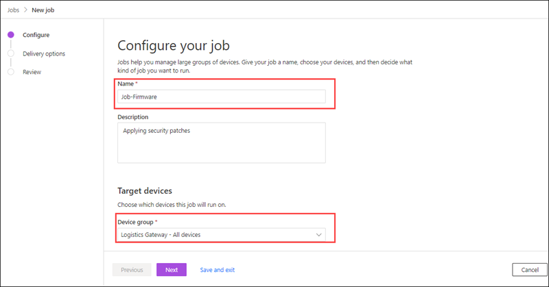

# Exercise 1: Getting Started with Azure IoT Central

## Overview

This exercise will cover how to get started with the IoT Central Connected logistics application template.

You will be performing the following activities:

## Instructions

### Getting Started with Lab

1. Once the environment is provisioned, a virtual machine (JumpVM) on the left and lab guide on the right will get loaded in your browser. Use this virtual machine throughout the workshop to perform the lab.

1. To get the lab environment details, you can select the **Lab Environment** tab, you can locate the **Lab Environment** tab on the upper right corner. Additionally, the credentials will also be emailed to your email address provided during registration.

   

 > You will see Suffix/DeploymentID value on the **Lab Environment** tab, please use it wherever you see SUFFIX or DeploymentID in lab steps. This is a unique number associated with each lab deployment. 
 
#### Task 1: Log in to Azure Portal and verify the pre-deployed resources

1. In the JumpVM, double click on the Azure portal shortcut on the desktop.

1. On Sign in to Microsoft Azure blade, you will see a login screen, in that enter the following email/username and then click on Next.

1. On **Sign in to Microsoft Azure** blade, you will see a login screen, in that enter the following email/username and then click on **Next**. 
   * Email/Username: <inject key="AzureAdUserEmail"></inject>

1. Now enter the following password and click on **Sign in**.
   * Password: <inject key="AzureAdUserPassword"></inject>

1. If you see the pop-up **Stay Signed in?**, click Yes

1. If you see the pop-up **You have free Azure Advisor recommendations!**, close the window to continue the lab.

1. If a **Welcome to Microsoft Azure** popup window appears, click **Maybe Later** to skip the tour.
   
1. In the upper left corner of the portal window, to open the **Resource Groups** menu, click the toggle menu icon and then click on **Resource groups**.

   

   This blade displays all of the resource groups that you have access to the Azure subscription.

1. You will find a pre-created resource named **iot-central-{deployment-id}**. This resource group contains all the resources required for the lab. Select the resource group and review the pre-created resources in the resource group. 

    
### Task 2: Create a connected logistics application 

1. In the virtual machine provided on the left side, open a new edge browser window and navigate to the **Azure IoT Central** (<https://apps.azureiotcentral.com/>).

1. From the top right corner click on user icon, when prompted use the azure credentials provided in the **Environment Details** tab to log in to the Azure IoT Central portal.

1. Select **Build** from the left-hand navigation bar and then select the **Retail** tab. Notice that there are several options which provide more advanced starting point for certain scenarios.

    
   
1. In **Retail** tab, select **Create app** under **Connected Logistics Application**.

    

1. **Create app** opens a **New application form**. Enter the following details:

     - **Application name**: Enter **Connected-logistics-DeploymentID**. Please find the DeploymentID from the **Lab Environment** tab.
     
     - **URL**: Leave it default.
     
     - **Pricing plan**: Select **Standard 2**.

     - **Billing info**: Select directory, Azure subscription, and region to provision the resources.
     
        
     
1. Click on **create** at the bottom of the page to deploy your application. 

1. Wait a few seconds while the app resource is built, then you should see a Dashboard with a few default links.

### Task 3: Explore the default key features in the application 

#### Explore Dashboard 
1. In the newly created application page from the left hand menu select **Dashboard**.

    

1. This dashboard is pre-configured to show the critical logistics device operations activity.

1. The dashboard enables two different gateway device management operations:

     - View the logistics routes for truck shipments and the location details of ocean shipments.

     - View the gateway status and other relevant information.
     
1. The dashboard consists of different kinds of tiles like **Location**, **Gateway state**, **Battery utilization**, **Multimodal transport** and much more.

    

1. From the dashboard you can track the total number of gateways, active, and unknown tags.

1. You can also do device management operations such as: update firmware, disable and enable sensors, update a sensor threshold, update telemetry intervals, and update device service contracts.

    
   
1. To customize the dashboard, from the top navigation menu click on **Edit**. After the dashboard is in edit mode, you can add new tiles or you can configure it.

    

1. On the edit dashboard page in the left navigation menu under **Dashboard settings**, enter a friendly name for your dashboard under **Dashboard name**. Optionally you can also select the type of visibility you want.

    

1. To add a new tile to your dashboard under **Add a tile** enter the following.
    
      - **Device Group**: From the drop down select **Logistics Gateway** device group.
      
      - **Devices**: Select all the devices.
      
      - **Telemetry**: Select any of the  telemetry you want to view.
      
      Once done click on **Add tile** button.
      
       

1. You can find your newly added tile on the dashboard.

    

1. From the **Dashboard** page you can also customize specific tiles. 

1. In the edit dashboard page select **Location** tile and click on **Configure** button from the top right of your location tile.

    

1. In the **Configure map** section, under **Time range** select **Past 1 hour** from the drop down and under **Devices** select all available devices. Click on **Update**.

    

1. Now in the **Location tile** observe the changes. In this way you can customize all the tiles based on your requirement.

1. Once you have made all the changes in the **Dashboard** click on **Save**.
  
    

#### Device Template

1. In the application page from the left navigation menu  select **Device templates** under **App settings**. Templates contain device capabilities  which can be telemetry, property, or command. They also determine how you view data from your devices.

1. In the **Device templates** page, click on **Logistics Gateway** to see the gateway capability model. A capability model is structured around the Gateway Telemetry & Property and Gateway Commands interfaces.

   

1. In the **Logistics Gateway** page click on **Gateway Telemetry & Property**. This interface defines all the telemetry related to sensors, location, and device information. The interface also defines device twin property capabilities such as sensor thresholds and update intervals.

   

1. Click on **Gateway Commands**, this interface organizes all the gateway command capabilities.

    

1. Now click on **Customize**. From here you can customize the **Device templates**. 

1. In the **Customize** page, find the ```Temp``` telemetry type. Update the **Display Name** of ```Temp``` to ```Temperature```.

    

1. Click on **Expand** icon, update the **Min value** to 70 and **Max value** to 90. Click on **Save**. 

    

1. Switch back to the **Device Templates** page, from here you can add new device templates by clicking on **+ New** icon. For now proceed to next task as we will see how to create **Device Templates** in the coming exercise.

#### Rules

1. From the left navigation menu select **Rules** to see the rules in this application template. These rules are configured to email notifications to the operators for further investigations.

    - **Gateway theft alert**: This rule triggers when there's unexpected light detection by the sensors during the journey. Operators must be notified immediately to investigate potential theft.

    - **Lost Gateway alert**: This rule triggers if the gateway doesn't report to the cloud for a prolonged period. The gateway could be unresponsive because of low battery, loss of connectivity, or device damage.
    
      
    
1. Click on **Gateway theft alert**, to enable the rule, toggle the **Enabled/Disabled** button in the rule header.

    

1. By default, the rule automatically applies to all the devices associated with the device template. To filter for a subset of the devices, select **+ Filter** and use device properties to identify the devices.

1. Under conditions section, select **light** in the **Telemetry** dropdown. Next, choose **Is less than** as the Operator and enter **1000** as the Value.

     

1. Optionally, you can set a **Time aggregation**. When you select a time aggregation, you must also select an aggregation type, such as average or sum from the aggregation drop-down.

     

1. After the condition is defined, you have to set up the actions to take when the rule fires. Actions are invoked when all the conditions specified in the rule evaluate to true.

1. Select **+ Email** in the Actions section.

     

1. Enter the display name for the action, your email address in the **To field**, and optionally enter a note to include in the text of the email.

     

1. To save the action, choose **Done** and click on **Save**. The rule goes live within a few minutes and starts monitoring telemetry being sent to your application. When the condition specified in the rule is met, the rule triggers the configured email action.

#### Jobs

1. Now from the left navigation menu select **Jobs**. Jobs lets you do bulk updates to device and cloud properties and run commands.

1. You can use jobs to do application-wide operations. The jobs in this application use device commands and twin capabilities to do tasks such as **Disabling** specific sensors across all the gateways or **Modifying** the sensor threshold depending on the shipment mode and route.

1. Jobs enable you to do system-wide operations such as **Updating firmware** on the gateways or **Updating service contract** to stay current on maintenance activities.
 
### Task 4 : Manage IoT Devices 

1. In the application page from the left navigation pane, select **Devices**. This will list all the devices that are connected to your application.

1. To add new device click on **+ New**. 

    

1. In create a new device page enter the following details:

     - **Template type**: Select Logistics Gateway.
     
     - **Device Name**:  Enter **Device-Test-DeploymentID**. Make sure to replace the **DeploymentID**.
     
     - **Device ID**: Leave it default.
     
     - **Simulate this device**: Turn the Simulated toggle to **On**.
     
     
     
 1. This device now appears in your device list for this application template.
 
 1. Click on your newly created device and select **Device Dashboard**. 
 
 1. In the **Device Dashboard** you can see status of your device, **Transportation mode**, **Battery life**, **Location** of the device and tags. It might take few minutes for the data to appear.
 
      
 
 1. Navigate to **Commands** tab from here you can run **Gateway Command**. Under **Gateway Commands / Disable Sensor** click on **Run**. 
 
      
 
 1. This command will disable the sensor, navigate to  **Device Dashboard** and verify that status of the  device is **Offline**.
 
      
 
 1. Navigate to **Raw data** tab, from here you can view the raw data that a device sends to an application. This view is useful for troubleshooting issues with the payload sent from a device.
 
      


#### Run Jobs

1. Now from the left navigation menu select **Jobs**. Jobs let you do bulk updates to device and cloud properties and run commands.

1. In the **Jobs** page select **+ New job**.

    

1. On the **Configure your job page**, enter a name and description to identify the job you're creating. Under **Target devices** section, select the target device group that you want your job to apply to. For now select **Logistics Gateway - All devices**.

    

1. In **Job properties** section under **Job type**, select **Command** from the drop down. Select **Update Firmware** under command and click on **Next** to go to **Delivery Options** page.

    

1. The **Delivery Options page** lets you set the delivery options for this job:

    - **Batches**: Batches let you stagger jobs for large numbers of devices. The job is divided into multiple batches and each batch contains a subset of the devices. The batches are queued and run in sequence.
    
    - **Cancellation threshold**: The cancellation threshold lets you automatically cancel a job if the number of errors exceeds your set limit. The threshold can apply to all the devices in the job, or to individual batches.
 
1. Select **Next** to move to the **Review** page. The Review page shows the job configuration details. Select **Run** to submit the job.
 
     
    
1. A job goes through **pending**, **running**, and **completed** phases. The job execution details contain result metrics, duration details, and a device list grid.

     

#### Configure device file uploads in IoT Central 

1. IoT Central lets you upload media and other files from connected devices to cloud storage.

1. In the application page from the left navigate menu, navigate to the **Administration** section.

1. In the **Administration** page click on **Device file upload**.

      

1. In the **Device file upload** tab enter the following details:

     - **Storage account**: Select the storage account with name **iotcentralfileuploadxxx**.
     
     - **Container**: Select **devicefilesupload** container.

     - **Request timeout**: 1

       
       
1. Click on **Save**. When the status shows Configured, you're ready to upload files from devices.
 
### Task 5: Analyze device data using Analytics in Azure IoT Central

1. Azure IoT Central provides rich analytics capabilities to analyze historical trends and correlate various telemetries from your devices.

1. From the left navigation menu, select **Analytics**. 

1. In the **Analytics** page under **Device group** select **Logistics Gateway - All devices**.

        

1. Under Telemetry select **Battery life**, click on settings button next to it and select **Aggregates** and select **Average**.

    
    
1. Click on **Add**.  Under Telemetry select **Humidity**, click on settings button next to it and select **Aggregates** and select **Minimum**.

    
    
1. Under **Spilt by** select **Device ID** and click on **Analyze**.

     
    
1. On the right hand side you can see the a chart control that visualizes the data as a line chart. You can toggle the visibility of specific lines by interacting with the chart legend.

     

1. In the Analysis page click on **Change Y-axis type**, from here you can change the Y-axis format. You can set the y-axis by choosing from one of three modes:

    - **Stacked**: A graph for every telemetry is stacked and each of the graphs have their own y-axis. This mode is set as default.
    
       

    - **Shared**: A graph for every telemetry is plotted against the same y-axis.
    
       
       
    - **Overlap**: Use it to stack multiple lines on the same y-axis, with the y-axis data changing based on the selected line.
    
       
    
1. You can use the **Interval Size** slider tool to zoom in and out of intervals over the same timespan. The slider provides more precise control of movement between large slices of time that show smooth trends down to slices as small as the millisecond, which allows you to display and analyze granular, high-resolution cuts of your data.

      

1. Click on **More Actions** which is present at the top right corner of the environment. From the dropdown, select **View data as Table**.

      

1. From here you can see results in table format, this enables you to view the specific value for each data point.

1. In this way you can analyze different telemetry options which are available.


     
     
