# Exercise 4: IoT Central Openness and Integrations

## Overview

In this exercise, you will see the openness and the integration capabilities of IoT Central

### Task 1: Control devices programmatically using IoT Central Rest API

#### Fetch API Tokens

1. In the application page from the left navigation menu, under App settings click on **Administration**.

1. In the **Administration** page select **API tokens**. In the API tokens page click on **+ Generate tokens**.

   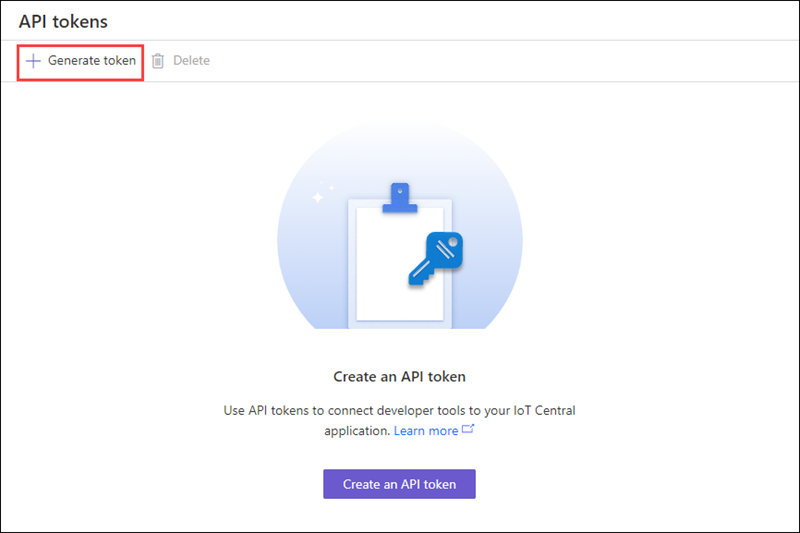 

1. Enter **admin** as the Token name and under **Role** select **Administrator**. Then select **Generate**.

   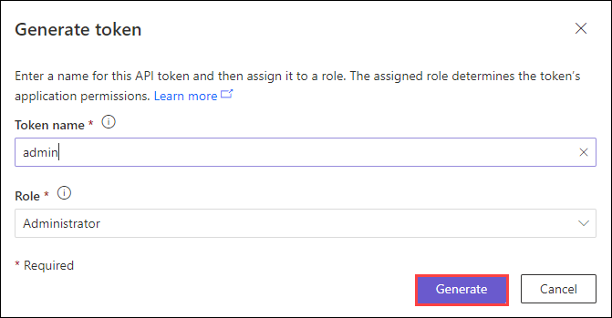 

1. Copy the generated **API token** and save it locally in a text file. If you lose the token, you'll have to regenerate it.

1. In the **Administrator** page click on **Your application** and copy the **Application name** value and save it locally in a text file.

   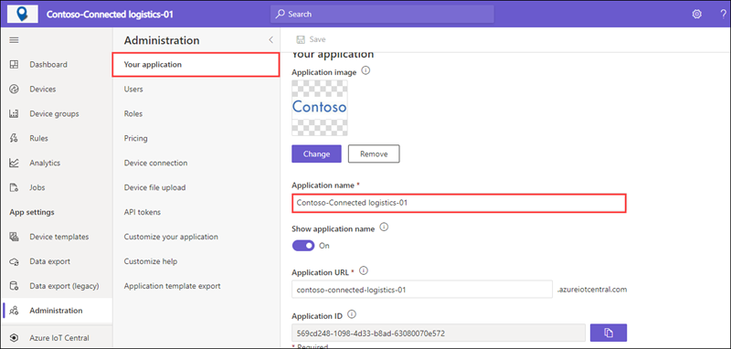 

1. In the **Application** web page from the left hand menu navigate to **Devices** and in **All devices** tab copy the **Device ID** of **SN 100** device. Save the value locally in the text file.

   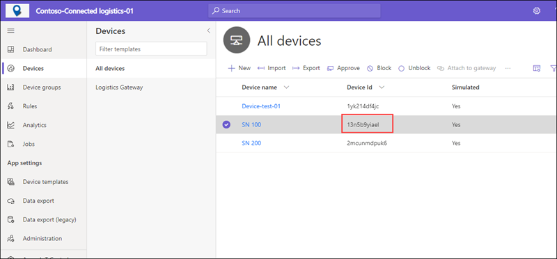 

1. Now open a new tab and sign in to **Azure portal** at  https://portal.azure.com/. When prompted enter the credentials provided in the environment details page.

1. From the **Azure portal**, open the **Azure Cloud Shell** by clicking on the icon in the top right of the Azure Portal.

   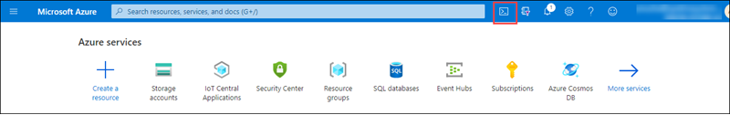 

     > **Note** : If this is the first time you are starting Cloud Shell and you are presented with the You have no storage mounted message, select the subscription you are using in this lab, and click on show advanced settings under storage account enter a unique name, under file share enter fileshare. Click on create storage.

1. When prompted to select either **Bash** or **PowerShell**, select **Bash**.

1. In the **Bash** session, within the Cloud Shell pane, replace the **ADD YOUR TOKEN HERE** in the following command with the **API Token** value which you copied earlier and run it. This command saves the **API token** in an environment variable to use later in the module.

    ```BASH
       API_TOKEN="ADD YOUR TOKEN HERE"
    ```
    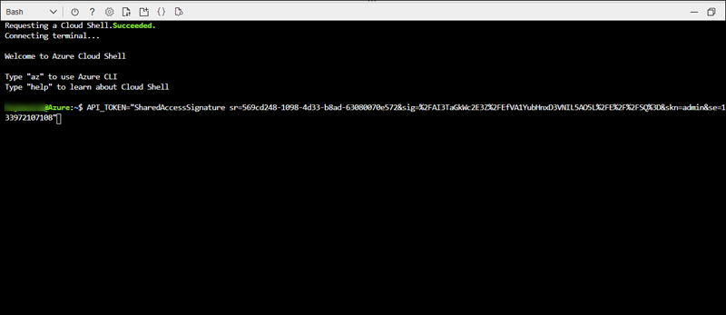 
    
1. Replace the **YOUR APPLICATION NAME** in the following command with your application name value which you copied earlier and run it in the Cloud Shell. This command saves the Application URL in an environment variable to use later in the module.

   
    ```BASH
        APP_NAME="ADD YOUR APPLICATION NAME HERE"
    ```
    
    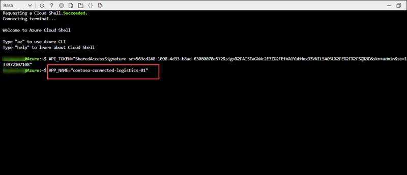 
        
 1. To get list of all available devices in your application run the following command.
   
     ```BASH
        az rest -m get -u https://$APP_NAME.azureiotcentral.com/api/preview/devices --headers Authorization="$API_TOKEN"
    ```
    
    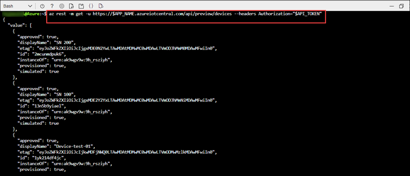 
    
 1. Replace the **device-id** in the following command with your **device-id** value which you copied earlier and run it in the Cloud Shell. This command provides the details about list of components associated with the device template.
 
     ```BASH
        az rest -m get -u https://$APP_NAME.azureiotcentral.com/api/preview/devices/device-id/components  --headers Authorization="$API_TOKEN"
    ```

    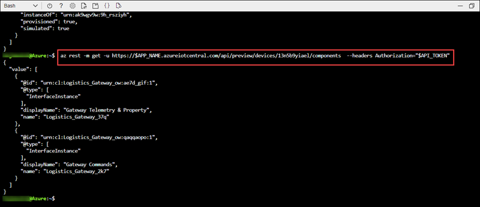 
    
1. Run the following command to **Disable sensor** on the device. Make sure to replace **device-id**.

   ```BASH
     az rest -m post  -u https://$APP_NAME.azureiotcentral.com/api/preview/devices/device-id/components/Logistics_Gateway_2k7/commands/DisableSensor  --headers Authorization="$API_TOKEN" --body '{"Disable Sensor": "DisableSensor"}'
   ```  
   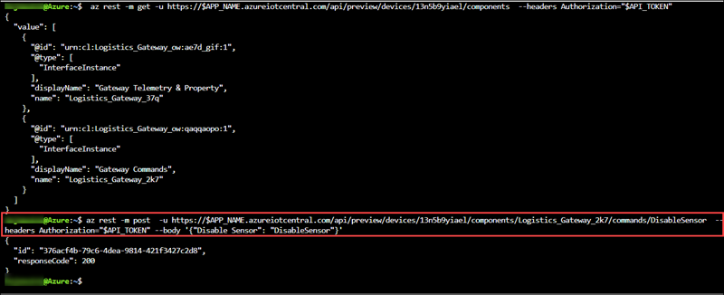
   
1. To verify output switch back to the browser tab where your application page is open. In the application page from the left hand menu select **Device** and click on **SN 100** device.

   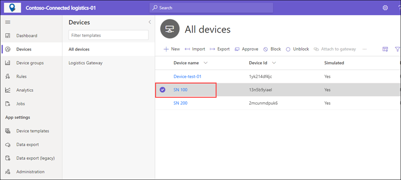 

1. In the device page click on **Raw data** tab and under **Timestamp** verify the status of device is **OFFLINE**.

   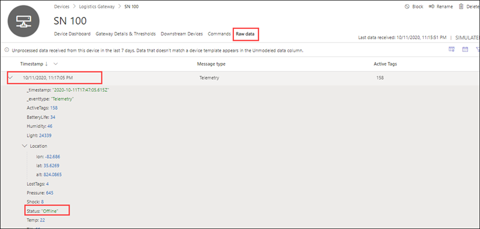 
   
### Task 2: Integrate IoT Central Application with other cloud services or existing enterprise and line of business solutions 

#### Logic flow

1. Now in the application page, from the left hand menu select **Rules**.

1. In the **Rules** page click on **+ New** to add a rule. Based on which an action will be triggered by the **Logic app** to restart the sensor for which it will disable it first and enable it.

1. In **Create new rule** page,  enter **Temperature-Sensor-Alert** as rule name. Under **Device template** select **Logistics Gateway**.

1. Under **Conditions sections** section, enable **Time aggregation and set **Select a time window** to **5 minutes**.

1. In the Telemetry dropdown select **Temp**, in the **Aggregation** dropdown select **Average**. Next, choose **Is greater than or equal to**  as the **Operator** and enter 70 as the Value.

1. Click on **Save**

1. Under **Actions** click on **+ Microsoft Azure Logic Apps**.  On the **Create Azure Logic Apps workflow** window click on **Go**. This will redirect you to the Logic App page in the azure portal .

1. Click on **Close** button. As the Logic App is pre-created in the lab.

1. Within the **Azure portal** click on  **Resource Groups**.

1. In the **Resource Groups** page click on **iotcentralrg-DeploymentID**.

1. In the resource group tab click on **iotcentrallogicapp**.

1. Now in the logic app page, from the left hand menu under **Development Tools** click on **Logic app designer**.

1. In **iotcentrallogicapp | Logic app designer** go to templates, select **Blank Logic App**.

1. Now in the search bar, search and select **Azure IoT Central V3**.

1. Under **Triggers** tab click on **When a rule is fired (preview)**. Then click on **Sign in**, when the sign in pop-up appreas login with your credentials(you can find it from the environment details page), click on **Accept**.

1. In **When a rule is fired(Preview)** tab, select **Contoso-Connected logistics-01** as **Application** and **Temperature-Sensor-Alert** as **Rule**. Click on **+New step**.

1. Now in **Choose an operation** tab click on **Azure IoT Central V3**. Under **Actions** select **Execute a device command(preview)**.

1. In the **Execute a device command(preview)** page, select the following:

     -  **Application** : Select **Contoso-Connected logistics-01**.
 
     -  **Device** : Enter the device id, which you copied in the previous task.
     
     - **Device Components** : Select **Gateway Commands**.
     
     - **Device Command** : Select **Disable Sensor**.
     
     - **Device Template** : Select **Logistic Gateway**.
     
     - **body** : Enter **{"Disable Sensor": "DisableSensor"}**.
     
 1. Click on **+ New step**. Now in **Choose an operation** tab click on **Azure IoT Central V3**. Under **Actions** select **Execute a device command(preview)**.
 
 1. In the **Execute a device command(preview)** page, select the following:

     -  **Application** : Select **Contoso-Connected logistics-01**.
 
     -  **Device** : Enter the device id, which you copied in the previous task.
     
     - **Device Components** : Select **Gateway Commands**.
     
     - **Device Command** : Select **Enable Sensor**.
     
     - **Device Template** : Select **Logistic Gateway**.
     
     - **body** : Enter **{"Enable Sensor": "EnableSensor"}**.
     
 1. Click on **Save**.
 
 1. When the **Temperature** condition is met, the rule will be triggered and logic app will automatically disable and enable the device.
 
 1. In the application page, from the left hand menu select **Devices**. In the **Devices** page select **SN 100**, and navigate to **Raw data** tab.
 
 1. Expand the recent timestamp and verify the result.
 
 1. To verify the trigger, switch to **Azure portal** and select your logic app. Under **Evalutaion**  click on **See trigger history** you should be able to see actions succeeded. 
 
 #### Explore connectors for continuous data export of IoT data from IoT Central Application to different destinations such as Azure Event Hubs, Blob Storage. 
 
 1. In the **Azure Portal** from the serach bar, search and select **Storage accounts**.
 
 1. Select **iotcentralfileupload(DeploymentID)** storage account. In the storage account page from the left navigation menu click on **Access Keys**.
 
 1. In the **Access Keys** page, copy the values of **Storageaccount name**, **Connection string** and save it locally in a text file.
 
 1. Switch back to IoT Central application page from the left hand menu, under **App settings** select **Data Export**.
 
 1. Click on **+New export** in the **Data Export** page.
 
 1. Enter **Telemetry-Data-Export** under export name. Make sure exports is **Enabled**.
 
 1. In **Data** section, under **Type of data to export**  select **Telemetry**.
 
 1. Under  **Destination** section, select the **Create a new one link** and add the following information:
 
    **Destination name** : Paste the storage account name which you copied earlier
    
    **Destination type** : Select **Azure Blob Storage**
    
    **Connection string** : Paste the connection string value which you copied earlier
    
    **Container** : Enter devicefilesupload

1. Select **Create**, then click on **Save**.

1. Data is exported once per minute, with each file containing the batch of changes since the previous export. Exported data is saved in JSON format

1. Switch to **Azure portal**, in **Storage account** page from the left hand menu select **Storage Explorer(preview)**.

1. In the storage explorer page expand **BLOB CONTAINERS** and select **devicefilesupload**.

1. Select the folder displayed and click on the blob, when prompted select **Click here to begin download**.

1. Open the downloaded file, you should be able to see output simliar to the screenshot.
 
 
 


